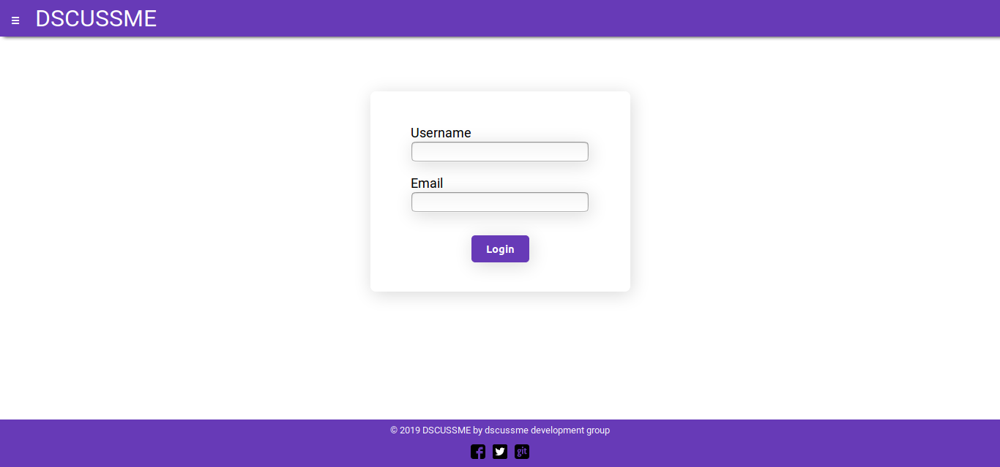
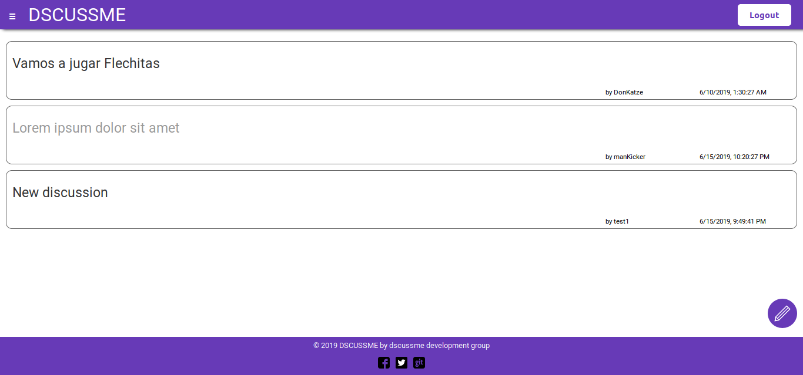
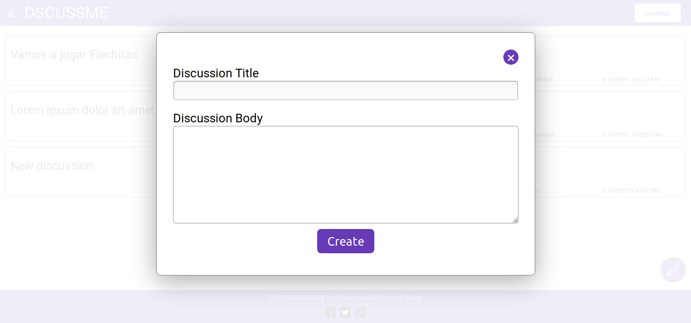
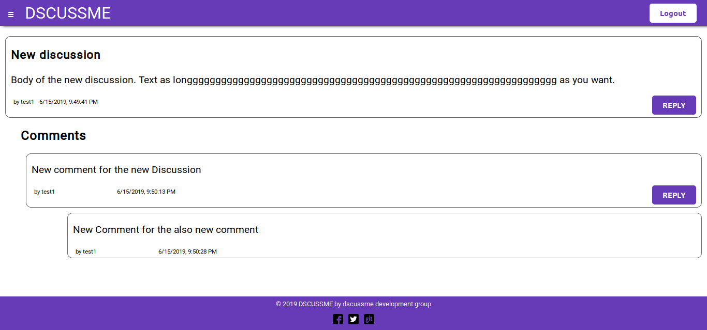
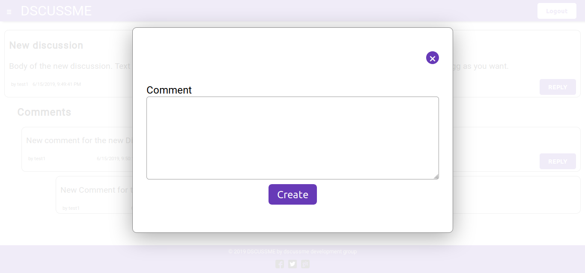

# React Advanced Extended Project

Create a simple discussion forum using React and Reach Router.

## Requirements

- [x] User should be asked for their username and email address.
  - [x] _Optional_: Those should be stored in localStorage and reused when the user access again.
- [x] After the user logged in it should see a list of discussions with their title and author.
- [x] The user can create a new discussion clicking a button.
  - [x] It should write the title and a body.
  - [x] The new discussion should have a date and author.
- [x] The user should be able to "log out" clicking a single button.
  - [x] _Optional_: It should remove the username and email from localStorage
- [x] Each discussion should be stored in localStorage and reused when the user access again.
- [x] When an user access a discussion it should see the title, author, date, and body of the discussion.
- [x] Each discussion should have a form to create a comment/reply.
- [x] Each comment/reply should have a body, author and date.
- [x] Each comment/reply could have new comments replying to them.
  - [ ] They should be displayed as nested comments.
- [x] The application should have routes for the login view, the list of discussions and the discussions individually.

## Acceptance Criteria

- [x] It must use semantic HTML
- [x] It must use React
- [x] It must be Responsive
- [x] It must use CSS in JS
- [x] It must have tests
- [x] It must use Reach Router
- [x] It could use Reach UI components
- [x] It must pass with green the Accessibility tests of the Chrome Audits
- [ ] It must pass with green the Best Practices tests of the Chrome Audits
- [x] It must pass with green the SEO tests of the Chrome Audits

## Members

- Cristian Granda
- Angie Gonzales
- Carlos Ayala

## Installation

```
yarn install
```

## Testing

```
yarn test
```

### Screenshots of the application






